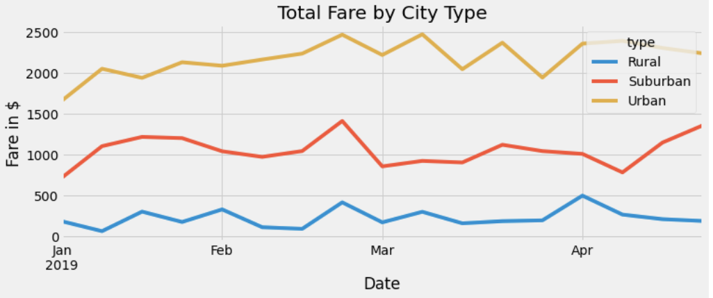

# PyBer Analysis

## Overview

In this specific project, the overall goal was to look at ride-sharing data and use it to find the following factors:
* Total rides
* Total drivers
* Total fares
* Average fare per ride and driver

and compare the differences of these factors in different city types such as: rural, suburban, and urban.

In addition, the goal was to demonstrate our results by visualizing with graphs and creating a summary DataFrame of the data. 

## PyBer Results:

### Total Rides
- Rural        125
- Suburban     625
- Urban       1625

### Total Drivers
- Rural         537
- Suburban     8570
- Urban       59602

### Total Fares
- Rural        $4327.93
- Suburban    $19356.33
- Urban       $39854.38

### Average Fare Per Ride 
- Rural       $34.623440
- Suburban    $30.970128
- Urban       $24.525772

### Average Fare Per Driver
- Rural       8.059460
- Suburban    2.258615
- Urban       0.668675

### Total Fare by City Type

